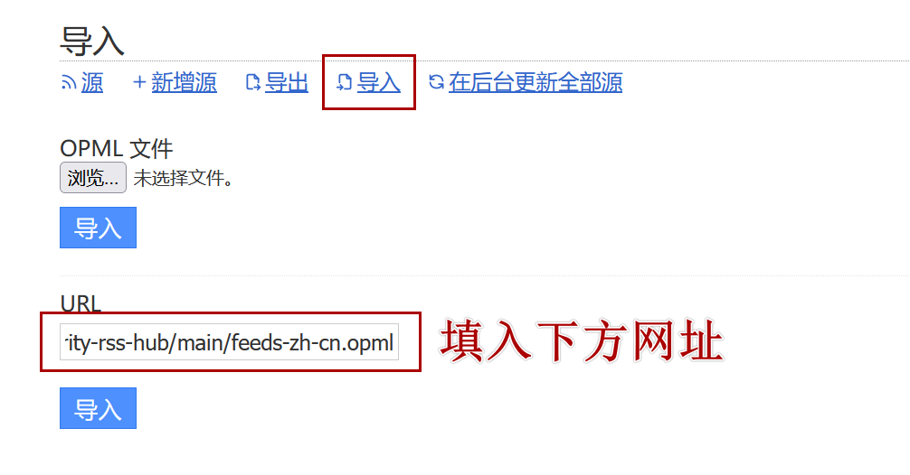
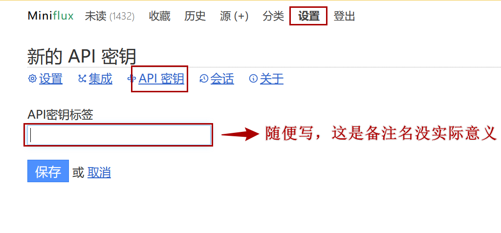
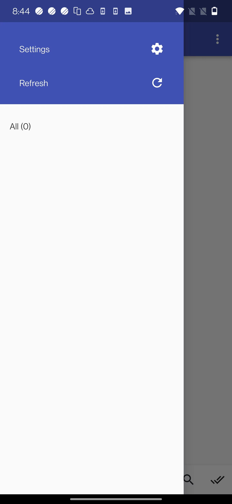
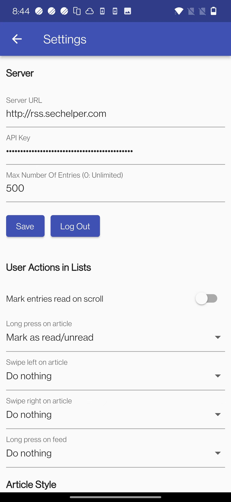
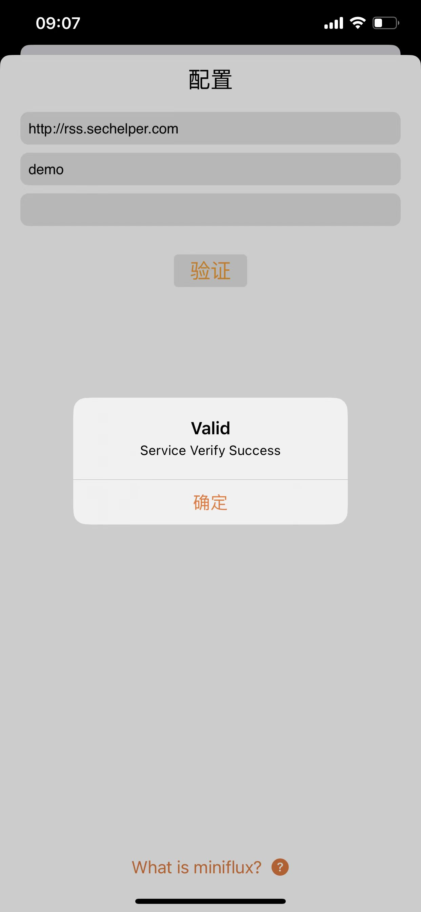
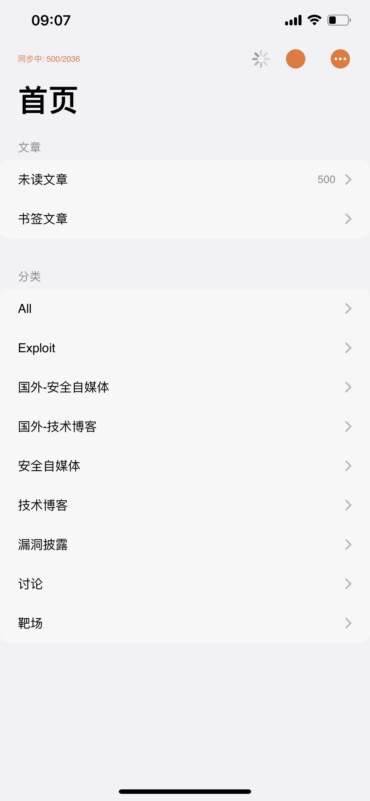
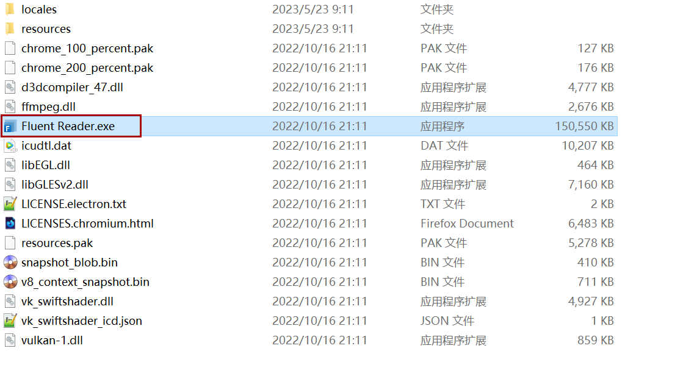
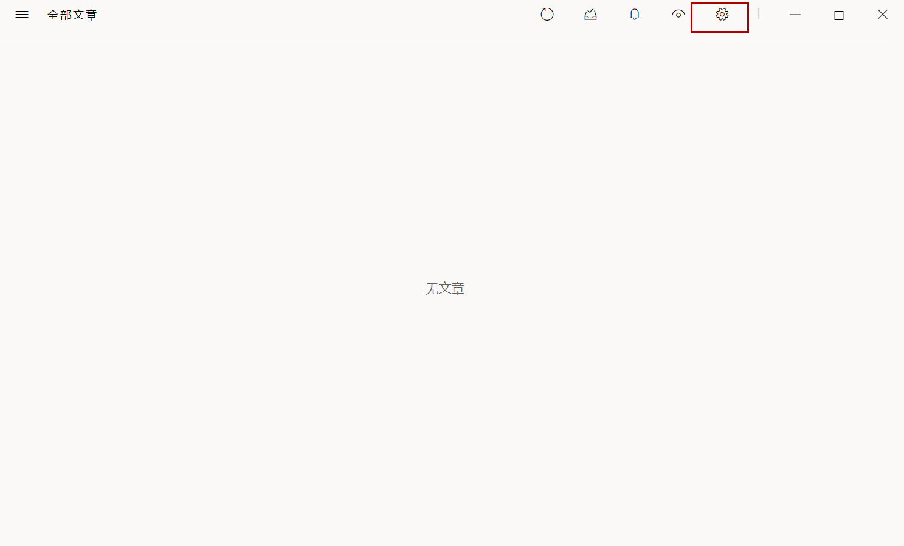
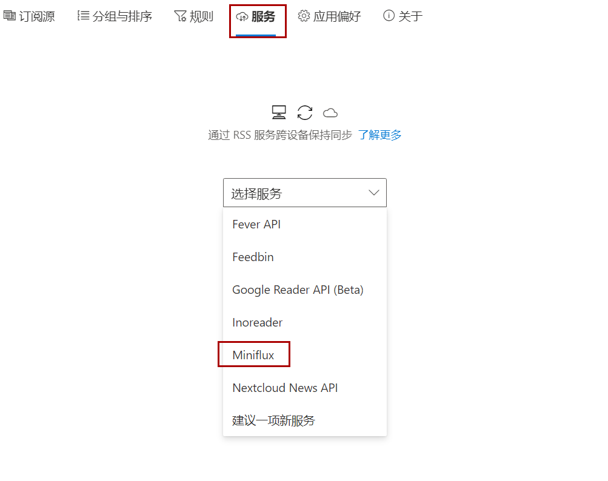
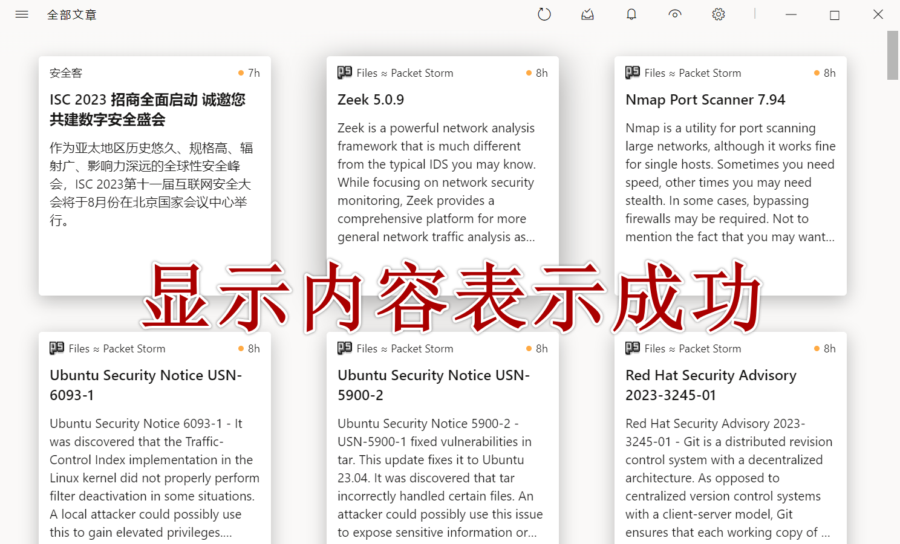

# RSS订阅中心使用手册

RSS订阅中心遇到问题可以群里交流，这里罗列一些常见使用方法。

## 【重要】基础配置

**修改语言**

Settings->Language->简体中文

**导入源**

拿到账户后一定要导入源，否则你什么都看不到。

<div style="display: grid; grid-template-columns: repeat(auto-fit, minmax(200px, 1fr)); overflow: hidden;">
    
</div>


```
https://raw.githubusercontent.com/sechelper/awesome-cybersecurity-rss-hub/main/feeds-zh-cn.opml
```

**创建API密钥**

注意`API`密钥不是密码。

设置->API 密钥->创建一个新的 API 密钥

<div style="display: grid; grid-template-columns: repeat(auto-fit, minmax(200px, 1fr)); overflow: hidden;">
    
    
</div>


**隐藏不需要的网站、分类**

编辑->隐藏全局未读列表中的文章    

**文章排序**

将`旧->新`调整成`新->旧`，否则开头看到的文章都是老文章。

## 客户端配置

这里罗列出坤哥给出的几个客户端使用方法。

### 安卓手机

安卓手机使用的是**API密钥**（不是账户密码，需要在WEB端生成），填写自己服务器地址，这里以坤哥的服务器做演示，配置成功会显示如右侧图片里的内容。

<div style="display: grid; grid-template-columns: repeat(auto-fit, minmax(200px, 1fr)); overflow: hidden;">
    
     
     
</div>

### 苹果手机

配置里填写的是账户密码（就是登入web的账户密码），配置成功如右图所示。

<div style="display: grid; grid-template-columns: repeat(auto-fit, minmax(200px, 1fr)); overflow: hidden;">
    
    
</div>

### Windows/Mac

<div style="display: grid; grid-template-columns: repeat(auto-fit, minmax(200px, 1fr)); overflow: hidden;">
    
    
</div>

<div style="display: grid; grid-template-columns: repeat(auto-fit, minmax(200px, 1fr)); overflow: hidden;">
    
    
</div>

<div style="display: grid; grid-template-columns: repeat(auto-fit, minmax(200px, 1fr)); overflow: hidden;">
    
</div>